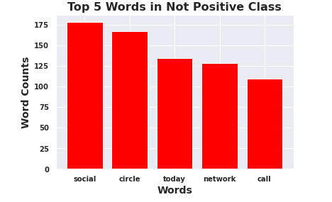
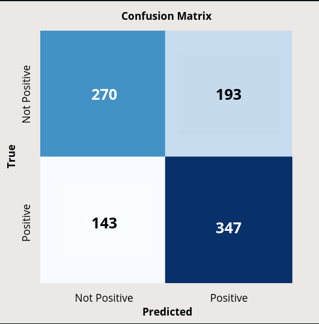

# Business Understanding

It is my job to help SXSW detect positive sentiment from tweets about their event so that they can continue to give people what they want and make improvements for future conferences.

# Data Understanding

This dataset comes from 'CrowdFlower' via data.world. 

- The initial dataframe contained roughly 9,000 tweets and information about the sentiment of the tweet as well as what brand or product the tweet was directed at.

Some limitations of the dataset included missing values as well as a class imbalance in the sentiment of the tweets.
    Over 50% of the tweets showed no emotion, about 33% showed a positive emotion, and only around 6% showed a negative emotion. Due to this imbalance I combined some of the 'no emotion' tweets with the 'negative emotion' tweets to create a 'Not Positive' class to match the 'Positive' class. 
    
- There was a lot of missing data from the emotion about the brands so I was unable to conduct analysis in this area.
- The dataset was also fairly small for predictive modeling.
 
    The dataset was suitable for the project because it allowed me to build a sentiment detection model from the text in the tweets against the target 'sentiment' of what tweets were considered positive and which were not.


Dataset: [Brands and Product Emotions](https://data.world/crowdflower/brands-and-product-emotions)

# Data Preperation

In this section I started by importing the necessary libraries and loading the dataset. 
- I checked for missing values and dropped a column because there were too many. 
- I renamed the columns for simplicity. 
- The sentiment column had 3 imbalanced categories so I combined them into 2 classes 'Positive' and 'Not Positive'. 
    - 'no emotion' and 'negative emotion' were combined because there was simply too few values in negative emotion. 
- I removed words with low semantic value. 
- I defined my X and y variables , 'X' as the tweets and 'y' as the sentiment. 
- I set up a 80/20 train, test, split. 
- I started preprocessing the text by bringing in stop words and created a function to get the part of speech of all the words. 
    - I also created a for loop to iterate through the whole corpus to remove punctuation and numbers, lower case everything and lemmatize the words. 
- I fit the data on a count vectorizer to get numerical features.
-I looked at feature importances for the words. 
- I looked at the top used words in both classes and created a bar chart of the top words for visualization purposes and possible recommendations.





# Modeling

We created 3 models

- Random Forest Model with hyperparamters (n_estimators, max_features, max_depth)
    Accuracy Score: 52%
- Multinomial Naive Bayes Model with hyperparameters (min, max)
    Accuracy Score: 49%
- Multinomial Naive Bayes Model with hyperparameters (alpha)
    Accuracy Score: 65%

We got to see how well the models were performing based on the metric accuracy and tried to improve them using hyperparameters. Results will be explained in the evaluation section.

# Evaluation

Our best performing model was our Multinomial Bayes model that used a GridSearch with hyperparameters, the alpha was set to 0.5. This is an example of Laplace smoothing which avoids the problem of zero probabilities of unseen words in the training data. The model was trained on data using a count vectorizer of all the words in the corpus after preprocessing. The model scored an 85% on accuracy in the training data but only scored about 65% on the testing data which is not great in determining whether tweets had positive sentiment or not. It also had a precision score that was roughly the same. We looked at accuracy as the best metric because in terms of minimizing false/negatives and false/positives, one was not more important than the other. Therefore precision and recall didn't matter as much as accuracy. It was a better metric because we had a balance in our classes. Our confusion matrix confirmed this by showing we had 616 correct predictions out of 953 possible instances in our sample.




# Conclusion

Our Multinomial Bayes model that was trained on vectorized data with the help of a Grid Search for hyperparameter tuning was our best performing model. This model had an 85% accuracy score on training data and a 65% accuracy on testing data. This is most likely due to overfitting from noise in the data. When we looked at feature importances and didn't see any words with significant importance which was most likely the contributing factor. The sample from our confusion matrix showed that the model correctly classified instances 616 times out of 953 instances. We discovered the top 5 frequently used words in the Positive class were 'party', 'win', 'one', 'time' and 'great'. The top 5 words for the Not Positive class were 'social', 'circle', 'today', 'network', and 'call'. We need to gather a lot more data, specifically with negative sentiment as this was lacking in the dataset forcing us to create a Not Positive class which was not ideal because there was a lot of data with no emotion mixed in with only a little bit of negative sentiment. We need to obtain 10x more data especially data with negative data to improve our model.

## Recommendations

I would recommend the words "party", "win", and "great" from the "positive" sentiment class to the SXSW marketing team to be used in advertising. I would also recommend the words "social", "circle", and "network" from the "not positive" class be looked into as why they are showing up as having either no emotion or negative emotion in tweets. These words should be used in a more positive way so I would recommend the marketing team possibly combining these words with the words from the positive class to try and improve the positive sentiment associated with them. 

## Limitations

Some limitations of the data was that there was initially a pretty heavy class imbalance in sentiment. Over half of the data (in this case tweets) showed to have no emotion. With only 33% showing positive sentiment and only around 6% showing negative sentiment. This forced me to combine no emotion tweets and negative tweets to create a 'Not Positive' category. This contributed to our models not being very accurrate. There were also a lot of missing values (nearly 2/3) of the data was missing from the 'emotion_in_tweet_is_directed_at' column so I was not able to analyze sentiment regarding certain products. There was a lot of noise in the data, there were not many words with high significant importance. After cleaning the data we were only able to work with around 6,000 entries which is fairly low when it comes to building predictive models. 

## Next Steps

We need to gather more data on negative sentiment as well as positive sentiment. Negative sentiment is just as useful and in some cases more useful information to have to know what to avoid and how to make improvements. We need to gather 10x more data from other social media platforms as well, not just twitter. Gathering information on specific areas of the conference (whether it be in film, music, education or brands in tech) will help SXSW become an even better more well rounded event rather than just looking at general sentiment towards the event.

## For More Information


See the full analysis in the [Jupyter Notebook](https://github.com/adammarianacci/Twitter_Analysis/blob/master/notebook.ipynb) or review this [presentation](https://github.com/adammarianacci/Twitter_Analysis/blob/master/presentation.pdf).

For additional info, contact Adam Marianacci (mailto:adam.marianacci@gmail.com)


## Repository Structure

```
├── data
├── images
├── README.md
├── presentation.pdf
└── notebook.ipynb
```